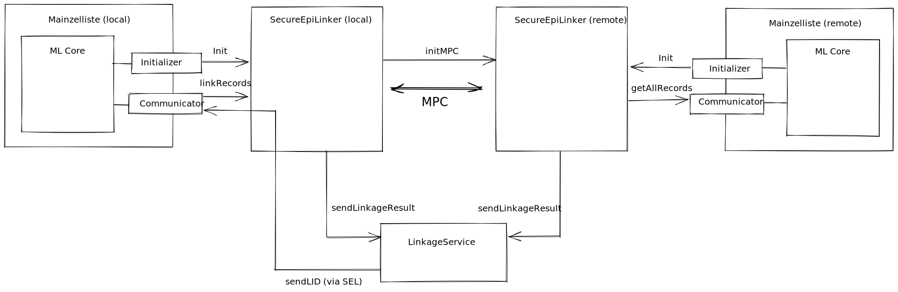

# MainSEL API Reference



This Document shows the main (external) API endpoints of MainSEL.
Last update: 31.03.2022

## TOC

 * [Process Overview](#process-overview)
 * [Preliminaries](#preliminaries)
 * [User-Facing API Endpoints](#user-facing-api-endpoints)
 * [Setup for Linkage ID Generation](#setup-for-linkage-id-generation)
 * [SEL Initialization (I)](#sel-initialization-i)
 * [Record Linkage (L)](#record-linkage-l)
 * [Record "Matching", Patient Intersection Cardinality (M)](#record-matching-patient-intersection-cardinality-m)
 * [Computation (C)](#computation-c)
 * [Status Monitoring (S)](#status-monitoring-s)

## Process Overview

 0. Setup for linkage
 1. Initialization (I)
 2. Linkage / Matching (L/M)
 3. Computation (C)
 4. Results / Status (S)

Steps 2. and 3. are interleaved.

## Preliminaries

### Abbreviations

 * **ML**: Mainzelliste
 * **SEL**: SecureEpilinker
 * **LS**: LinkageService
 * **LID**: Linkage ID

### Global SEL Identifier
Each ML has a global ID, which consists of the character set `[a-zA-Z0-9_]`
(i.e. alphanumeric plus '_'). This global ID is also registered at the
LS for LID management. Under this ID the LS stores the
Identifier Encryption Keys and each global ID is assigned to an API key.

### Authorization
The reference implementation uses a protocol based on HTTP BASIC authentication.
The APIKey passed in the initialization phase is transmitted as an HTTP header
in the following way:
```
Authorization: apiKey apiKey="<APIKey>"
```
Thus the specification follows [rfc2617](http://www.ietf.org/rfc/rfc2617.txt).

### Modes of operation

MainSEL can operate in two modes:

 1. Record Linkage with LID generation/management. Sometimes just
    called "linkage". Requires a LS.
 2. Calculation of set intersection cardinality, i.e., sum of match bits.
    Sometimes called "matching". Does not require a LS.

## User-Facing API Endpoints


|     | Name               | Description                                                                                    | Caller    | Callee | API Endpoint at Callee                    |
|-----|--------------------|------------------------------------------------------------------------------------------------|-----------|--------|-------------------------------------------|
| I.3 | testRemote         | The connection to and configuration of a remote party is tested and the connection established | ML / User | SEL    | /test/<remote_id>                         |
| I.4 | testLinkageService | The connection to a LE is tested and established                                               | ML / User | SEL    | /testLS/<remote_id>                       |
| -   | triggerLinkMN      | Initiate the record linkage between local ML and remote ML                                     | User      | ML     | /Communicator/linkMN/trigger/<remote_id>  |
| -   | triggerMatchMN     | Initiate the matching of the local ML against the remote ML                                    | User      | ML     | /Communicator/matchMN/trigger/<remote_id> |
| -   | getMatchStatus     | The user queries the ML for the final matching result                                          | User      | ML     | /Communicator/matchMN/status/<remote_id>  |


## Setup for Linkage ID Generation

### MainSEL Registration
Each new MainSEL in the federation must register its global ID with the Linkage
Service (LS). The LS then generates a secret key for this party for LID
(re)encryption. For security reasons, this process must be deliberately
performed locally by the LS administrator and is not exposed via a REST API.

### InitIDs
Since the L.1 call assumes that LIDs already exist in the remote ML, they must
initially be generated for the remote party.

#### Request
The ML designated as remote sends a
**HTTP GET** request to the linkage service address
`https://{linkage-service}:{ls-port}/freshIDs/<ML_id>?count=n` to obtain n valid
IDs, where n is the size of the entire ML database. A ML can only request valid
IDs for itself.

### Response
For a successful request, "200 OK" is sent with the generated LIDs as a JSON
object in the response body.

In case of a failed authentication "401 Unauthorized" is sent.

In case of an invalid request syntax "400 Bad Request" is sent.

If the LS is in an error state, it will respond with "500 Internal Server Error"
or "503 Service Unavailable". In the latter case a recovery time is sent with
the "Retry-After" header if possible.

### Example
```
// HTTP - GET Request http://<linkage-service>/freshIDs/<global-ML-id>?count=n
// Authentication via HTTP header
// Response: base64 encoded list of n new ids
{
'linkageIds': [
'Rm9vQmF...yCg==',
...
'QmFyQmF...6Cg=='
]
```

## SEL Initialization (I)
A Mainzelliste (ML) must initialize its local SecureEpilinker (SEL) once. If SEL
is restarted (update, system reboot, ...) this process must be repeated, since
SEL deliberately does not persist states. Each ML/SEL pair must run through this
process, it does not differ between local and remote system.

|     | Name               | Description                                                                                    | Caller    | Callee | API Endpoint at Callee  |
|-----|--------------------|------------------------------------------------------------------------------------------------|-----------|--------|-------------------------|
| I.1 | initLocal          | ML configures local SEL to allow local communication                                           | ML        | SEL    | /initLocal              |
| I.2 | initRemote         | ML adds a remote party to local SEL                                                            | ML        | SEL    | /initRemote/<remote_id> |
| I.3 | testRemote         | The connection to and configuration of a remote party is tested and the connection established | ML / User | SEL    | /test/<remote_id>       |
| I.4 | testLinkageService | The connection to a LE is tested and established                                               | ML / User | SEL    | /testLS/<remote_id>     |

### Step I.1: Local Initialization

#### Request
To establish a connection between ML and SEL, the ML initializer sends a
TLS-authenticated and secured **HTTP PUT** to
`https://{sel-host}:{sel-port}/initLocal`.

Since the local API key is not configured until this step, this call is
unauthenticated.

The following data is transferred:

 1. global identifier of the main cell list ("localId")
 2. information about the local authentication
 3. information about the data service providing the patient data (in the reference implementation the main cell list).
   1. URL
   2. Other fields dependent on the data service such as caching information, pagesizes, etc.
 4. linkage configuration
   1. algorithm type
      * "epilink"
   2. score from which an entry is identified as a hit
   3. score below which an entry is treated as a non-hit.
   4. existing Exchange Groups
      1. fields of the groups are identified by field names
   5. information about the used fields
      1. field name
      2. frequency (cf. MainSEL publication)
      3. error rate (cf. MainSEL publication)
      4. comparison type
         * "dice" for scoring on dice coefficients.
         * "binary" for comparison on exact matches
      5. data type of fieldv.
         * "bitmask"
         * "integer"
         * "number
         * "string"
      6. bit length of the field

The authentication information is passed as an object with an authentication
type and the type appropriate information:

 1. type
    * apiKey
 2. shared key

The field type specification, following the [JSON Schema - Draft 4
standard](https://tools.ietf.org/html/draft-zyp-json-schema-04), distinguishes
between "integer", which is an integer value, and "number", which can be an
integer or a floating point number. The decimal separator is a dot.

Fields of type "bitmask" are sent base64 encoded. The comparison type "dice" is
only valid for the data type "bitmask". The comparison type "binary" is not
valid for fields of the "bitmask" data type.

Note: The default bitlengths are as follows:

 1. for Integer the bit length is ceil( log2( maximum allowed value) ),
 2. for doubles the bit length is 64 bit according to IEEE,
 3. for strings the bit length is (maximum number of characters) * 8 and
 4. bitmasks have the Bloom filter length of 500 bit.

#### Response
If the connection is successfully established, SEL responds "204 No Content".

If a local configuration already exists, it is updated and "200 OK" is
transmitted with the body "Updated connection".

If the request is not valid, "400 Bad Request" is transmitted.

If SEL is in an error state, it will respond with "500 Internal Server Error" or
"503 Service Unavailable". In the latter case a recovery time is sent in the
"Retry-After" header if possible.

#### Example
```
// HTTP - PUT from Mainzelliste to https://sel.verbis.dkfz.de:1234/initLocal
{
  "localId": "TUD",
  "localAuthentication": {
    "authType": "apiKey",
    "sharedKey": "123abc"
  },
  "dataService": {
    "url": "https://ml.verbis.dkfz.de:8080/rest/api/getAllRecords"
  },
  "algorithm": {
    "algoType": "epilink",
    "threshold_match": 0.9,
    "threshold_non_match": 0.7,
    "exchangeGroups": [[
      "firstname",
    "lastname",
    "birthname"
    ]],
    "fields": [{
      "name": "firstname",
      "frequency": 0.000235,
      "errorRate": 0.01,
      "comparator": "dice",
      "fieldType": "bitmask",
      "bitlength": 500
    },
    {
      "name": "lastname","frequency": 0.0000271,
      "errorRate": 0.008,
      "comparator": "dice",
      "fieldType": "bitmask",
      "bitlength": 500
    },
    {
      "name": "birthname",
      "frequency": 0.0000271,
      "errorRate": 0.008,
      "comparator": "dice",
      "fieldType": "bitmask",
      "bitlength": 500
    },
    {
      "name": "birthday",
      "frequency": 0.0333,
      "errorRate": 0.005,
      "comparator": "binary",
      "fieldType": "number",
      "bitlength": 5
    },
    {
      "name": "birthmonth",
      "frequency": 0.0833,
      "errorRate": 0.002,
      "comparator": "binary",
      "fieldType": "integer",
      "bitlength": 4
    },
    {
      "name": "birthyear",
      "frequency": 0.0286,
      "errorRate": 0.004,
      "comparator": "binary",
      "fieldType": "integer",
      "bitlength": 12
    },
    {
      "name": "zipcode",
      "frequency": 0.01,
      "errorRate": 0.04,
      "comparator": "binary",
      "fieldType": "integer",
      "bitlength": 17
    },
    {
      "name": "city",
      "frequency": 0.01,
      "errorRate": 0.04,
      "comparator": "dice",
      "fieldType": "bitmask",
      "bitlength": 500
    }]
  }
}
// HTTP Reply 204 No Content
```

### Step I.2: Remote Initialization

#### Request
To establish a connection between the main cell list and secureEpiLink for a
pair relationship, the initializer of the main cell list sends a TLS
authenticated and secured **HTTP PUT** to
`https://{sel-host}:{sel-port}/init/{remote_id}`."remote_id" is the unique
identifier of the remote peer. The identifier "local" is
reserved for local initialization.

The following data is transferred:

 1. connection profile
    1. remote URL
    2. remote authentication
 2. linkage service information
    1. URL
    2. authentication information
 3. `matchingAllowed` flag -- is the calculation of the set intersection
    cardinality allowed? Default: false

The authentication information is passed as an object with an authentication
type and the type appropriate information:

    1. type
       * apiKey
    2. shared key

#### Response
If the connection is successfully created, SEL responds "204 No Content".

If a connection with the given ID already exists, it is updated and "200 OK" is
sent with the body "Updated connection".

In case of a failed authentication "401 Unauthorized" is sent.

In case of an invalid request syntax "400 Bad Request" is sent.

If SEL is in an error state, it will respond with "500 Internal Server Error" or
"503 Service Unavailable". In the latter case a recovery time is sent with the
"Retry-After" header if possible.

#### Example
```
// HTTP - PUT from Mainzelliste to https://sel.verbis.dkfz.de:1234/initRemote/<remote-id>
{
  "connectionProfile": {
    "url": "http://sel.mhh.de:1664",
      "authentication": {
        "authType": "apiKey",
        "sharedKey": "xkcd123"
      }
  },
    "linkageService": {
      "url": "https://ls.verbis.dkfz.de/",
      "authentication": {
        "authType": "apiKey",
        "sharedKey": "bcd234"
      }
    },
    "matchingAllowed": true // may be omitted, defaults to 'false'.
}
// HTTP Reply 204 No Content
```
### Step I.3: testRemote

#### Request
The user sends a **HTTP GET** to `https://{sel-host}:{sel-port}/test/<remote_id>`.

#### Response
If a connection is successfully tested and established, "200 OK" is
sent with the body "Remotes Connected".

In case of an invalid request syntax "400 Bad Request" is sent.

If SEL is in an error state, it will respond with "500 Internal Server Error" or
"503 Service Unavailable". In the latter case a recovery time is sent with the
"Retry-After" header if possible.

### Step I.4: testLinkageService
#### Request
The user sends a **HTTP GET** to `https://{sel-host}:{sel-port}/test/<remote_id>`.

#### Response
If a connection is successfully tested and established, "200 OK" is
sent with the body "Linkage Service connected".

In case of an invalid request syntax "400 Bad Request" is sent.

If SEL is in an error state, it will respond with "500 Internal Server Error" or
"503 Service Unavailable". In the latter case a recovery time is sent with the
"Retry-After" header if possible.

## Record Linkage (L)
This process links (a) local record(s) against the remote database. This process
can occur any number of times in succession once process I (initialization) has
been successfully executed.


|      | Name              | Description                                                                                       | Caller           | Callee | API Endpoint at Callee   |
|------|-------------------|---------------------------------------------------------------------------------------------------|------------------|--------|--------------------------|
| L.1a | linkRecord        | The ML creates a record linkage job by providing a single record and the result callback address  | ML               | SEL    | /linkRecord/<remote_id>  |
| L.1b | linkRecords       | The ML creates a record linkage job by providing multiple records and the result callback address | ML               | SEL    | /linkRecords/<remote_id> |
| L.2  | sendLinkageResult | Both SELs send their XOR shares to the linkage service. The resulting LID(s) are in the response  | local+remote SEL | LS     | /linkageResult           |
| L.3  | linkCallback      | SEL sends the LID received in L.6 to the given callback address                                   | SEL              | ML     | <callback_url>           |


### Step L.1a: linkRecord

#### Request
To request SEL to perform a (single record) record linkage with "remote_id", the
communicator of the ML sends a TLS authenticated and secured **HTTP
POST** to `https://{sel-host}:{sel-port}/linkRecord/{remote_id}`.

This call is not idempotent, multiple identical calls generate multiple linkage
requests.

The following data is transferred:

 1. callback information
    1. Callback URL
 2. data fields

Empty fields are encoded as "null", e.g. for JSON as the null data type.

#### Response
If successful, SEL replies "202 Accepted". In the "Location" header field, the
position of the status query of the linkage job is transmitted (cf. [Status
Monitoring](#Status-Monitoring-(S))).

If the transmitted fields do not match the configuration initialized in process
I, "401 Unauthorized" is transmitted.

If the request is made before the initialization has been performed, "400 Bad
Request" is replied.

If SEL is in an error state, it will respond with "500 Internal Server Error" or
"503 Service Unavailable". In the latter case a recovery time is sent with the
"Retry-After" header if possible.

#### Example
```
// HTTP POST from Mainzelliste to https://{sel-host}:{sel-port}:8081/linkRecord/dkfz
{
  "callback": {
    "url": "https://mlc.verbis.dkfz.de/linkCallback?idType=link%3ATUD%3ADKFZ&idString=randomRef",
  },
  "fields": {
    "firstname": "I07A1YM4aKNXlQ...", // base64 encoded 500-bit bloom filter
    "lastname": "5f3dPPzqJvw=...",
    "birthname": null,
    "birthday": 24,
    "birthmonth": 12,
    "birthyear": 1864,
    "zipcode": 65432,
    "city": "EFXma8cPVEA=..."
  }
}
// HTTP Reply 202 Accepted, Content-Location: /jobs/0012345823
```

### Step L.1b: linkRecords

#### Request
To request SEL to perform a (multiple records) record linkage with "remote_id",
the communicator of the ML sends a TLS authenticated and secured
**HTTP POST** to `https://{sel-host}:{sel-port}/linkRecords/{remote_id}`.

This call is not idempotent, multiple identical calls generate multiple linkage
requests.

The following data is transferred:

 1. callback information
    1. Callback URL
 2. records
    1. data fields
 3. number of records

Empty fields are encoded as "null", e.g. for JSON as the null data type.

#### Response
If successful, SEL replies "202 Accepted". In the "Location" header field, the
position of the status query of the linkage job is transmitted (cf. [Status
Monitoring](#Status-Monitoring-(S))).

If the
transmitted fields do not match the configuration initialized in process I, "401
Unauthorized" is transmitted.

If the request is made before the initialization
has been performed, "400 Bad Request" is replied.

If SEL is in an error state,
it will respond with "500 Internal Server Error" or "503 Service Unavailable".
In the latter case a recovery time is sent with the "Retry-After" header if
possible.

#### Example
```
// HTTP POST from Mainzelliste to https://{sel-host}:{sel-port}:8081/linkRecords/dkfz
{
  "callback": {
    "url": "https://mlc.verbis.dkfz.de/linkCallback?idType=link%3ATUD%3ADKFZ&idString=randomRef",
  },
    "total":1250,
    "toDate": 1232345512,
    "records": [{
      "fields": {
        "firstname": "I07A1YM4aKNXlQ...", // base64 encoded 500-bit bloom filter
        "lastname": "5f3dPPzqJvw=...",
        "birthname": null,
        "birthday": 24,
        "birthmonth": 12,
        "birthyear": 1864,
        "zipcode": 65432,
        "city": "EFXma8cPVEA=..."
      }},
    {"fields": {
                 "firstname": "I07A1YM4aKNXlQ...", // base64 encoded 500-bit bloom filter
                 "lastname": "5f3dPPzqJvw=...",
                 "birthname": null,
                 "birthday": 24,
                 "birthmonth": 12,
                 "birthyear": 1864,
                 "zipcode": 65432,
                 "city": "EFXma8cPVEA=..."
               },
    ...
      ]
    }
// HTTP Reply 202 Accepted, Content-Location: /jobs/0012345823
```

### Step L.2: sendLinkageResult

#### Request
Both SELs send a **HTTP POST** request to the configured LS address. The
reference implementation uses the address
`https://{LS-host}:{LS-port}/linkageResult/<local_id>/<remote_id>`.
The Request contains a JSON object with the following properties:

 1. role
    * server
    * client
 2. result
    1. match bit share
    2. tentative match bit share
    3. bestIndex share
 3. encrypted LIDs, if role == server

#### Response
The LS responds to the client with a JSON object containing one or more linkage
IDs results. Optionally, the LS may include a warning field or, in case of a
failed calculation, an error description.

#### Example
```
// HTTP POST of both SEL to LS https://ls.mitro.dkfz.de/linkageResult/<local-id>/<remote-id>
{
  "role": "server" // or "client"
    "result": {
      "match": 0, // XOR share of match bit
        "tentativeMatch": 1, // XOR share of tentative match bit
        "bestIndex" : 4 // XOR share of best match index
    },
    "ids": ["FooBar=", ...] // only if role == server
}
```
LS reply to client:
```
{
  "result": [
  {"linkageId": "FooBar=" // base64 encoded linkage id, encrypted with key for local ML},
  {"linkageId": "FooBar=" // base64 encoded linkage id, encrypted with key for local ML},
  ...
  ],
  "warning": "The following problem occurred during computation: ....",
  "error": "Linkage server timeout" // Only if no result was generated
}
```

### Step L.3: linkCallback
The local SEL forwards the record linkage result as a JSON object in a **HTTP POST**
request. The JSON object adheres to the following form:
```
// HTTP POST to callback from linkRecord, e.g., "https://mlc.mitro.dkfz.de/linkCallback?idType=link%3ATUD%
3ADKFZ&idString=randomRef"
// Header: apiKey
{
  "result": {
    "linkageId": "FooBar=" // base64 encoded linkage id, encrypted with key for local ML
  },
    "warning": "The following problem occurred during computation: ....",
    "error": "Linkage server timeout" // Only if no result was generated
}
```
The "warning" and "error" properties are optional. The "error" property may
only be included if no result was computed.

If multiple records were linked (cf. L.1b), the "result" property is an array of
LID objects:
```
// HTTP POST to callback from linkRecords, e.g., "https://mlc.mitro.dkfz.de/linkCallback?idType=link%3ATUD%
3ADKFZ&idString=randomRef"
// Header: apiKey
{
  "result": [
    {"linkageId": "FooBar="}, // base64 encoded linkage id, encrypted with key for local ML
    {"linkageId": "FooBar="}, // base64 encoded linkage id, encrypted with key for local ML
    ...
    ],
    "warning": "The following problem occurred during computation: ....",
    "error": "Linkage server timeout" // Only if no result was generated
}
```

## Record "Matching", Patient Intersection Cardinality (M)

This process calculates the set intersection cardinality of one (set of) records
and the remote database. This process can occur any number of times in
succession once process I (initialization) has been successfully executed.

|      | Name          | Description                                                                                 | Caller | Callee | API Endpoint at Callee    |
|------|---------------|---------------------------------------------------------------------------------------------|--------|--------|---------------------------|
| M.1a | matchRecord   | The ML creates a matching job by providing a single record and the result callback address  | ML     | SEL    | /matchRecord/<remote_id>  |
| M.1b | matchRecords  | The ML creates a matching job by providing multiple records and the result callback address | ML     | SEL    | /matchRecords/<remote_id> |
| M.2  | matchCallback | SEL sends the set intersection cardinality calculated before to the given callback address  | SEL    | ML     | <callback_url>            |

### Step M.1a: matchRecord

#### Request
To request SEL to perform a (single record) matching with "remote_id", the
communicator of the ML sends a TLS authenticated and secured **HTTP
POST** to `https://{sel-host}:{sel-port}/linkRecord/{remote_id}`.

This call is not idempotent, multiple identical calls generate multiple matching
requests.

The following data is transferred:

 1. callback information
    1. Callback URL
 2. data fields

Empty fields are encoded as "null", e.g. for JSON as the null data type.
#### Response
If successful, SEL replies "202 Accepted". In the "Location" header field, the
position of the status query of the matching job is transmitted (cf. [Status
Monitoring](#Status-Monitoring-(S))).

If the transmitted fields do not match the configuration initialized in process
I, "401 Unauthorized" is transmitted.

If the request is made before the initialization has been performed, "400 Bad
Request" is replied.

If SEL is in an error state, it will respond with "500 Internal Server Error" or
"503 Service Unavailable". In the latter case a recovery time is sent with the
"Retry-After" header if possible.

#### Example
```
// HTTP POST from Mainzelliste to https://{sel-host}:{sel-port}:8081/matchRecord/dkfz
{
  "callback": {
    "url": "https://mlc.verbis.dkfz.de/matchCallback?idType=link%3ATUD%3ADKFZ&idString=randomRef",
  },
  "fields": {
    "firstname": "I07A1YM4aKNXlQ...", // base64 encoded 500-bit bloom filter
    "lastname": "5f3dPPzqJvw=...",
    "birthname": null,
    "birthday": 24,
    "birthmonth": 12,
    "birthyear": 1864,
    "zipcode": 65432,
    "city": "EFXma8cPVEA=..."
  }
}
// HTTP Reply 202 Accepted, Content-Location: /jobs/0012345823
```

### Step M.1b: matchRecords

#### Request
To request SEL to perform a (multiple records) matching with "remote_id",
the communicator of the ML sends a TLS authenticated and secured
**HTTP POST** to `https://{sel-host}:{sel-port}/matchRecords/{remote_id}`.

This call is not idempotent, multiple identical calls generate multiple matching
requests.

The following data is transferred:

 1. callback information
    1. Callback URL
 2. records
    1. data fields
 3. number of records

Empty fields are encoded as "null", e.g. for JSON as the null data type.

#### Response
If successful, SEL replies "202 Accepted". In the "Location" header field, the
position of the status query of the matching job is transmitted (cf. [Status
Monitoring](#status-monitoring-s)).

If the
transmitted fields do not match the configuration initialized in process I, "401
Unauthorized" is transmitted.

If the request is made before the initialization
has been performed, "400 Bad Request" is replied.

If SEL is in an error state,
it will respond with "500 Internal Server Error" or "503 Service Unavailable".
In the latter case a recovery time is sent with the "Retry-After" header if
possible.

#### Example
```
// HTTP POST from Mainzelliste to https://{sel-host}:{sel-port}:8081/matchRecords/dkfz
{
  "callback": {
    "url": "https://mlc.verbis.dkfz.de/matchCallback?idType=link%3ATUD%3ADKFZ&idString=randomRef",
  },
    "total":1250,
    "toDate": 1232345512,
    "records": [{
      "fields": {
        "firstname": "I07A1YM4aKNXlQ...", // base64 encoded 500-bit bloom filter
        "lastname": "5f3dPPzqJvw=...",
        "birthname": null,
        "birthday": 24,
        "birthmonth": 12,
        "birthyear": 1864,
        "zipcode": 65432,
        "city": "EFXma8cPVEA=..."
      }},
    {"fields": {
                 "firstname": "I07A1YM4aKNXlQ...", // base64 encoded 500-bit bloom filter
                 "lastname": "5f3dPPzqJvw=...",
                 "birthname": null,
                 "birthday": 24,
                 "birthmonth": 12,
                 "birthyear": 1864,
                 "zipcode": 65432,
                 "city": "EFXma8cPVEA=..."
               },
    ...
      ]
    }
// HTTP Reply 202 Accepted, Content-Location: /jobs/0012345823
```
### Step M.2: matchCallback
The local SEL transfers the matching result as a JSON object in a **HTTP POST**
request. The JSON object adheres to the following form:
```
// HTTP POST to callback from matchRecord, e.g., "https://mlc.verbis.dkfz.de/matchCallback?id=<counter>"
// Header: apiKey
{
  "result": {
    "matches": 7,
    "tentativeMatches": 10
  },
  "warning": "The following problem occurred during computation: ....",
  "error": "Remote party unreachable." // Only if no result was computed
}
```
The "warning" and "error" properties are optional. The "error" property may
only be included if no result was computed.


## Computation (C)
Some signaling is necessary to perform the chosen computation. These calls are
interleaved with the L or M process calls.
|     | Name          | Description                              | Caller    | Callee     | API Endpoint at Callee    |
|-----|---------------|------------------------------------------|-----------|------------|---------------------------|
| C.1 | initMPC       | Signal remote SEL to prepare calculation | local SEL | remote SEL | /initMPC                  |
| C.2 | getAllRecords | Request all records from remote ML       | remoteSEL | remote ML  | /getAllRecords/<local_id> |

### Step C.1: initMPC
The local SEL signals the remote SEL that it wants to perform a record linkage/matching.
Subsequently, the remote SEL retrieves the database of its ML.

### Step C.2: getAllRecords
The remote SEL requires the entire set of records. For that, it requests those
data form the remote ML. Note, that at the moment no caching is implemented.
#### Request
Since we want to preserve the navigability, all data except the ApiKey is passed along via the URL.
The remote SEL performs a **HTTP GET** request to `https://{ML-host}:{ML-port}/getAllRecords/<requester-id>`.
#### Response
In case of failed authentication "401 Unauthorized" is replied.

In case of a malformed request "400 Bad Request" is replied.

A successful reply transmits a JSON object containing the records, according to
the following example.
Empty fields are encoded as "null", e.g. for JSON as the null data type.
Note, for matching mode no ID field is required in the records array.

#### Example
```
// HTTP Get from remote SEL to https://ml.verbis.dkfz.de:8080/rest/api/getAllRecords/TUD
{
  "total":1250,
    "toDate":1524096000,
    "localId": "DKFZ",
    "remoteId": "TUD",
    "records":[
    {
      "fields":{
        "firstname":"I07A1YM4aKNXlQ...",
        "lastname":"5f3dPPzqJvw=...",
        "birthname":"kj8ictbYoOM=...",
        "birthday":24,
        "birthmonth":12,
        "birthyear":1864,
        "zipcode":"65432",
        "city":"EFXma8cPVEA=..."
      },
      "id": "12345",
    },
    {
      "fields":{
        "firstname":"I07A1YM4aKNXlQ...",
        "lastname":"5f3dPPzqJvw=...",
        "birthname":"kj8ictbYoOM=...",
        "birthday":24,
        "birthmonth":1,
        "birthyear":1964,
        "zipcode":"65432",
        "city":"EFXma8cPVEA=..."
      },
      "id": "23231",
    },
    ...
  ]
}
```

## Status Monitoring (S)
This process can run in parallel to processes L and M and enables the current
processing status of one or all matching/linkage requests to be queried.

|     | Name           | Description                                                              | Caller    | Callee | API Endpoint at Callee                   |
|-----|----------------|--------------------------------------------------------------------------|-----------|--------|------------------------------------------|
| S.1 | jobStatus      | ML or user sends the job ID to SEL and receives a processing status back | ML / User | SEL    | /jobs/<job_id>                           |
| S.2 | statusList     | ML or user receives the status of all jobs                               | ML / User | SEL    | /jobs/list                               |

### Step S.1: jobStatus

#### Request
The ML or user sends a **HTTP GET** request to the local SEL under the resource
`/jobs/<job-id>`.

#### Response
The ML receives the job status as a string in the response body.
Possible states are:

 * QUEUED
 * RUNNING
 * HOLD
 * FAULT
 * DONE

If no job with the given ID exists, the response body is empty.

### Step S.2: statusList

#### Request

The ML or user sends a **HTTP GET** request to the local SEL under the resource
`/jobs/list`.
#### Response

The ML receives all job status as a JSON object in the response body.
The JSON object has the form:
```
{
  "<job-id>": "<status>",
  ...
}
```
Possible states are:

 * QUEUED
 * RUNNING
 * HOLD
 * FAULT
 * DONE

If no job  exists, the JSON is empty.
